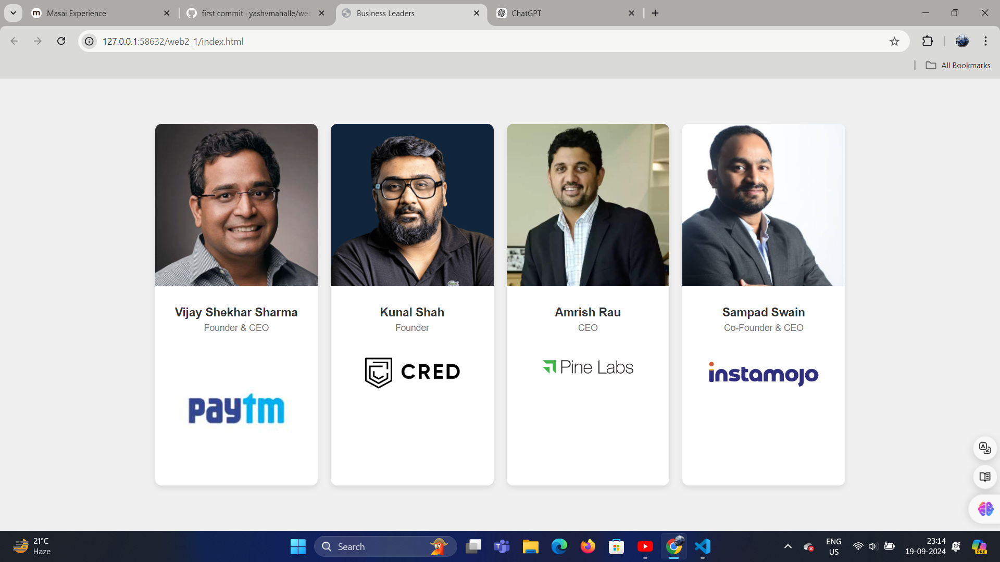

Business Leaders Webpage
This project is a simple webpage showcasing prominent business leaders and their roles in their respective companies. The webpage is designed using HTML and CSS and provides information about each leader with their portrait and company logo.

Features
Responsive design: The layout is flexible and adapts to different screen sizes.
Clean layout: Each leader's details are displayed in individual cards.
Images and branding: Includes portraits and logos of the respective companies.

Project Structure
index.html: Contains the main structure of the webpage, including the cards for each business leader.
CSS: The styles are embedded within the index.html file using a <style> tag. It defines the layout and appearance of the page.
Preview
The webpage contains the following sections:

Vijay Shekhar Sharma - Founder & CEO of Paytm.
Kunal Shah - Founder of CRED.
Amrish Rau - CEO of Pine Labs.
Sampad Swain - Co-Founder & CEO of Instamojo.

How to Run the Project
Clone the repository:
bash
Copy code
git clone https://github.com/YOUR-USERNAME/business-leaders-webpage.git
Navigate to the project directory:
bash
Copy code
cd business-leaders-webpage
Open the index.html file in your preferred browser:
bash
Copy code
open index.html
Technologies Used
HTML5
CSS3
Future Enhancements
Add more business leaders.
Improve responsiveness for smaller screens.
Integrate animations for a more dynamic user experience.
Feel free to replace YOUR-USERNAME with your actual GitHub username. Let me know if you'd like to make any adjustments or add more details!

screenshot output

